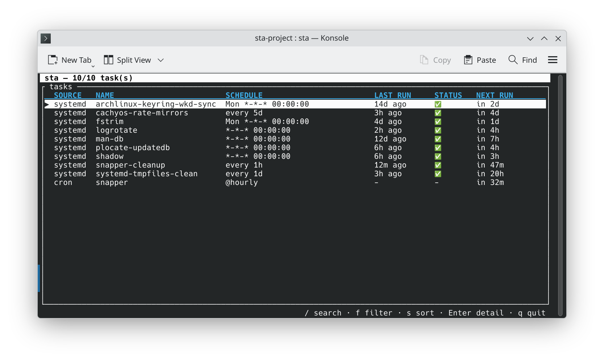
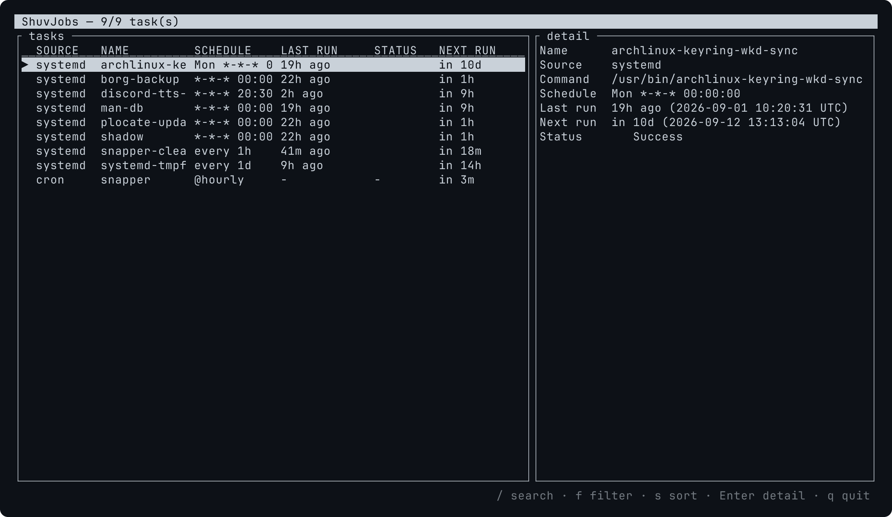
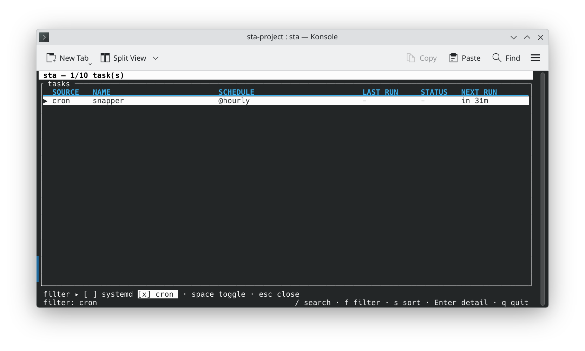

# ShuvJobs

ShuvJobs is a unified terminal interface for inspecting every
scheduled task on a Linux or macOS host: cron, systemd timers, `at`,
anacron, and launchd.

## Screenshots

### Main View



### Detail Pane



### Filter Mode



## Why

A typical Linux server has scheduled work in three different places at
once: systemd timers under `systemctl list-timers` (in both the system
and per-user managers), system crontabs
under `/etc/cron.{d,hourly,daily,weekly,monthly}`, and per-user
crontabs under `crontab -l`. macOS adds launchd to the mix. Each
subsystem has its own command, output format, and convention for "next
run" and "last result". Auditing what's actually scheduled to fire on
a host means running four or five commands, parsing their output by
hand, and reconciling the differences.

`shuvjobs` collapses all of that into a single sortable, filterable table.

## Features

- One unified table for cron, systemd timers, `at`, anacron, and launchd
- Both systemd scopes: system timers and the calling user's own
  `systemctl --user` timers, shown as `name (user)`
- Live filter by source kind
- Sort by next run, last run, name, or status
- Detail pane with the full command, schedule expression, last status, and run duration
- Absolute timestamps in your local timezone, with the UTC offset spelled out
- Substring search across name and command
- Non-blocking auto-refresh on a configurable interval, plus manual refresh with `r`
- Remote-host mode over SSH — no binary upload, runs the host's own commands
- JSON export for scripting and pipelines
- Soft-skip for unavailable subsystems (systemd on macOS, launchd on Linux, etc.)

ShuvJobs is currently read-only. Full create, update, and delete management
across every supported scheduler is the fork's next product milestone.

## Installation

```sh
cargo install --git https://github.com/shuv1337/shuvjobs shuvjobs
```

Crates.io, AUR, and Homebrew packages are planned.

## Usage

### Local TUI

Run with no arguments to inspect the current host:

```sh
shuvjobs
```

### Remote host over SSH

`shuvjobs` does not ship a binary to the remote machine. It opens an SSH
connection, runs the same commands an operator would type by hand
(`systemctl`, `crontab -l`, `atq`, `cat /etc/anacrontab`, and so on),
and parses the output locally.

```sh
shuvjobs --host user@hostname
```

SSH key authentication must already be set up — `shuvjobs` runs in
`BatchMode=yes` and never prompts for a password.

#### Custom SSH port

```sh
shuvjobs --host user@hostname --port 2222
```

#### Custom SSH key

```sh
shuvjobs --host user@hostname --key ~/.ssh/id_ed25519
```

### JSON export

Print every collected task as a JSON array and exit:

```sh
shuvjobs --json
```

Works in both local and remote mode and is intended for piping into
other tools:

```sh
shuvjobs --host user@hostname --json | jq '.[] | select(.source == "systemd")'
```

### Auto-refresh

Re-collect and redraw every N seconds:

```sh
shuvjobs --refresh 30
```

Combine with remote mode for continuous monitoring of a server:

```sh
shuvjobs --host user@hostname --refresh 60
```

Collection runs on a background thread, so the table stays scrollable,
searchable, and filterable while a refresh (including a slow SSH round-trip) is
in flight. The header shows `refreshing…` while one is running, and the interval
is measured from the last *completed* refresh, so refreshes never stack up.

Press `r` at any time to refresh immediately — with or without `--refresh`. A
request made while a refresh is already in flight is ignored.

If a refresh fails, the last successfully collected data stays on screen and the
header shows `refresh failed: <reason>` until the next successful refresh; the
TUI does not exit.

## Keyboard shortcuts

| Key             | Action                                        |
|-----------------|-----------------------------------------------|
| `j` / `↓`       | Move selection down                           |
| `k` / `↑`       | Move selection up                             |
| `Page Down`     | Move selection 10 rows down                   |
| `Page Up`       | Move selection 10 rows up                     |
| `Home`          | Jump to first row                             |
| `End`           | Jump to last row                              |
| `Enter` / `l`   | Open detail pane for the selected row         |
| `Esc` / `h`     | Close detail pane                             |
| `f`             | Open the source filter bar                    |
| `Space`         | Toggle source under cursor (in filter mode)   |
| `s`             | Cycle sort mode                               |
| `r`             | Refresh now                                   |
| `/`             | Enter search mode                             |
| `Backspace`     | Delete one character (in search mode)         |
| `q`             | Quit                                          |

## Platform support

| Source   | Arch / CachyOS | Debian / Ubuntu | Fedora / RHEL | Alpine        | macOS         |
|----------|----------------|-----------------|---------------|---------------|---------------|
| systemd  | yes            | yes             | yes           | optional      | unavailable   |
| cron     | optional       | yes (vixie)     | yes (cronie)  | yes (busybox) | yes (legacy)  |
| at       | optional       | optional        | optional      | optional      | optional      |
| anacron  | optional       | yes             | yes           | no            | no            |
| launchd  | unavailable    | unavailable     | unavailable   | unavailable   | yes           |

"Unavailable" means the adapter is silently skipped on that platform.
"Optional" means the subsystem may not be installed; if it is not,
that source is silently skipped too.

User-scope systemd timers are collected in addition to system timers,
locally and over SSH. Their ids are prefixed with `user/` and their
names are suffixed with `(user)`. When no user manager is reachable —
no session bus, no `loginctl enable-linger` on a remote host, or root
without `XDG_RUNTIME_DIR` — that scope is silently skipped and system
timers are still reported.

## Contributing

Pull requests are welcome. Before submitting:

1. Run `cargo test` and make sure everything passes.
2. Run `cargo clippy --workspace --all-targets` and address any
   warnings.
3. Run `scripts/check-identity.sh`.
4. If you are touching a parser, add a fixture test. Real captured
   command output beats idealized examples — see the existing
   fixtures in `crates/shuvjobs-adapters/src/*.rs` for the convention.

For larger changes please open an issue first to discuss the
approach.

## License

MIT — see [LICENSE](LICENSE).
